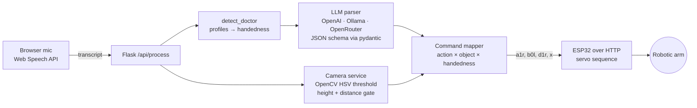

# Voice-guided surgical arm

Spoken instruction in, robotic-arm command out. A surgeon says "Sarath, start the incision"; the system transcribes it, asks an LLM to turn it into a structured `{tool, action, handedness}` with the surgeon's profile applied, checks the camera for an object in the pick zone, and sends a two-character command plus handedness suffix to an ESP32 that drives the arm.

It is a full loop over speech, language, vision and hardware, with the parts that can be measured without a robot measured: the LLM parser is evaluated on a labelled set of spoken instructions, and the command mapper is unit-tested.

## Architecture



| Stage | What it does | Where |
|---|---|---|
| Speech | Browser Web Speech API streams a transcript; an offline Vosk path exists for no-network use | `frontend/static/js/app.js`, `backend/services/speech_service.py` |
| Doctor detection | Finds a configured surgeon name in the transcript and looks up handedness | `llm_service.detect_doctor` |
| LLM parsing | Prompt with rules and examples, JSON-only output, validated into a `ToolAction` model; tolerant of markdown fences and prose | `backend/prompts.py`, `llm_service.parse_tool_action` |
| Vision | HSV colour mask → largest contour → pixel-to-cm calibration → height and distance tolerance check; or colour-only mode | `backend/services/camera_service.py` |
| Command mapping | `(action, object_present, handedness)` → ESP32 command; synonyms such as *suture* and *hold* normalised; unknown action → `x` no-op | `backend/services/command_service.py` |
| Actuation | HTTP call to the ESP32 firmware in `esp32_enhanced/`, which runs the servo sequence for that command | `backend/services/esp32_service.py` |

## Measured behaviour

**LLM parser** (`application/eval/eval_parser.py`, 30 labelled spoken instructions including six speech-to-text corruptions such as "in session" for *incision* and "switching" for *stitching*; local `llama3.1` via Ollama on an Apple M5):

| metric | value |
|---|---|
| valid JSON replies | 1.00 |
| tool accuracy | 0.97 |
| action accuracy | 1.00 |
| handedness accuracy | 1.00 |
| exact match (all three fields) | 0.97 |
| **correct ESP32 command** | **1.00** |
| p50 latency | 2.6 s idle GPU (4.7 s while sharing the GPU with a training job) |

The one exact-match failure is "kiran cut here": the label says scissors, the model chose a scalpel. Both are defensible for an unqualified "cut", which is an argument for the prompt to ask for clarification when the tool is ambiguous rather than a parser error.

The gap between `exact_match` and `command_acc` on the first run (0.97 vs 0.87) was the mapper, not the model: the model answered *suture* and *hold* for stitch and grasp, and the mapper only knew the canonical words, so four correct parses became no-op commands. Synonym normalisation in `CommandService` closed that gap; the table above is the run after the fix. That is exactly the kind of failure an end-to-end metric catches and a per-field metric hides.

Re-run with your own model:

```bash
cd application
LLM_PROVIDER=ollama LLM_MODEL=llama3.1 python eval/eval_parser.py     # writes eval/results.md
```

**Vision and actuation** are not measured here; they depend on the physical rig (camera height, lighting, arm geometry) and the numbers would not transfer.

## Tests

```bash
pip install -r application/requirements.txt pytest
pytest -q tests        # 28 tests, no model, camera or hardware needed
```

Covers the full action × object × handedness command matrix, colour-only mode, synonym handling, malformed LLM output, JSON recovery from fenced or chatty replies, and doctor detection. CI runs them on every push.

## Repository layout

```
application/
├── backend/
│   ├── app.py, routes.py        Flask app and API
│   ├── config.py                env-driven settings, doctor profiles, command map, synonyms
│   ├── prompts.py               parser prompt and variants
│   └── services/                llm, camera, command, esp32, speech
├── frontend/                    single-page UI with mic capture
├── eval/                        instructions.jsonl, eval_parser.py, results.md
└── requirements.txt
esp32/, esp32_enhanced/          Arduino firmware for the arm
tests/                           pytest suite
```

## Speech model

Offline speech recognition uses a [Vosk](https://alphacephei.com/vosk/models) model, which is not stored in this repository. Download and unzip it into `application/models/`:

```bash
mkdir -p application/models && cd application/models
curl -LO https://alphacephei.com/vosk/models/vosk-model-small-en-us-0.15.zip
unzip vosk-model-small-en-us-0.15.zip && rm vosk-model-small-en-us-0.15.zip
```

## 🚀 Quick Start

### Prerequisites

- Python 3.8+
- Microphone access (for voice recognition)
- Modern web browser (Chrome/Edge recommended for speech recognition)

### Installation

1. **Navigate to the application directory:**
   ```bash
   cd application
   ```

2. **Create and activate virtual environment:**
   ```bash
   python3 -m venv venv
   source venv/bin/activate  # On Windows: venv\Scripts\activate
   ```

3. **Install dependencies:**
   ```bash
   pip install -r requirements.txt
   ```

4. **Configure environment variables:**
   ```bash
   cp env.example .env
   # Edit .env with your API keys and settings
   ```

5. **Run the application:**
   ```bash
   python backend/app.py
   ```

6. **Access the application:**
   - Frontend: http://localhost:5000
   - API: http://localhost:5000/api

## ⚙️ Configuration

Edit the `.env` file to configure the application:

```env
# Server settings
HOST=0.0.0.0
PORT=5000
DEBUG=True

# Hardware settings
USE_CAMERA=False          # Set to True to enable camera
USE_ESP32=False           # Set to True to enable ESP32

# LLM settings
LLM_PROVIDER=openai       # openai | ollama | openrouter
LLM_MODEL=gpt-4o-mini     # Model name for selected provider

# ESP32 settings
ESP32_ADDRESS=http://192.168.0.131

# API Keys (fill with your actual keys)
OPENAI_API_KEY=your_openai_api_key_here
OPENROUTER_API_KEY=your_openrouter_api_key_here
```

### LLM Provider Setup

#### OpenAI
1. Get API key from [OpenAI Platform](https://platform.openai.com/)
2. Set `LLM_PROVIDER=openai`
3. Set `OPENAI_API_KEY=your_key`

#### Ollama
1. Install Ollama locally: https://ollama.ai/
2. Set `LLM_PROVIDER=ollama`
3. Set `LLM_MODEL=qwen2.5:1.5b` (or your preferred model)

#### OpenRouter
1. Get API key from [OpenRouter](https://openrouter.ai/)
2. Set `LLM_PROVIDER=openrouter`
3. Set `OPENROUTER_API_KEY=your_key`

## 🎯 Usage

### Web Interface

1. **Open the application** in your browser: http://localhost:5000
2. **Click the voice button** or press **Space** to start recording
3. **Speak your instruction** (e.g., "hi sarath, you can start the incision")
4. **Click "Send"** to process the instruction
5. **View results** in the results section

### API Testing

Test the API directly using curl:

```bash
curl -X POST http://localhost:5000/api/process \
     -H "Content-Type: application/json" \
     -d '{"instruction":"hi sarath, you can start the incision"}'
```

### API Endpoints

#### POST `/api/process`
Process a surgical instruction through the complete pipeline.

**Request:**
```json
{
  "instruction": "hi sarath, you can start the incision"
}
```

**Response:**
```json
{
  "llm_result": {
    "tool": "scalpel",
    "action": "incision",
    "handedness": "right",
    "doctor": "sarath"
  },
  "detection": {
    "object_detected": false,
    "height": null,
    "mode": "test"
  },
  "command": "a",
  "esp32_response": {
    "success": true,
    "command": "a",
    "response": "OK (test mode)",
    "mode": "test"
  },
  "success": true
}
```

#### GET `/api/status`
Get system status and configuration.

#### GET `/api/test`
Test all services and return their status.

#### GET `/api/health`
Simple health check endpoint.

#### GET `/api/prompts/config`
Get available prompt configurations.

**Response:**
```json
{
  "configs": ["default", "detailed", "conservative"],
  "current": "default"
}
```

#### POST `/api/prompts/config`
Set prompt configuration.

**Request:**
```json
{
  "config": "detailed"
}
```

**Response:**
```json
{
  "success": true,
  "config": "detailed",
  "message": "Prompt configuration changed to: detailed"
}
```

#### GET `/api/commands/mappings`
Get all command mappings.

**Response:**
```json
{
  "mappings": {
    "incision": "a0",
    "incision_with_object": "a1",
    "stitch": "b0",
    "stitch_with_object": "b1",
    "object_detected": "c"
  },
  "actions": ["incision", "stitch", "grasp", "cut"]
}
```

#### POST `/api/commands/mappings`
Add a new command mapping.

**Request:**
```json
{
  "action": "grasp",
  "command_without_object": "d0",
  "command_with_object": "d1"
}
```

**Response:**
```json
{
  "success": true,
  "action": "grasp",
  "mappings_added": 2,
  "message": "Added 2 mapping(s) for action: grasp"
}
```

## 🔧 Development

### Prompt Configurations

The application supports multiple prompt configurations for different use cases:

- **`default`**: Standard surgical assistant prompt with balanced accuracy
- **`detailed`**: More verbose responses with detailed reasoning
- **`conservative`**: Conservative tool selection with lower temperature

**Change prompt configuration via API:**
```bash
# Get available configurations
curl http://localhost:5000/api/prompts/config

# Set configuration
curl -X POST http://localhost:5000/api/prompts/config \
     -H "Content-Type: application/json" \
     -d '{"config": "detailed"}'
```

### Camera Configuration

The camera service now supports configurable detection parameters:

- **`CAMERA_DETECTION_DISTANCE`**: Target distance for object detection (cm)
- **`CAMERA_DETECTION_HEIGHT`**: Target height for object detection (cm)
- **`CAMERA_HEIGHT_TOLERANCE`**: Acceptable height range (cm)
- **`CAMERA_DISTANCE_TOLERANCE`**: Acceptable distance range (cm)
- **`CAMERA_PIXELS_PER_CM`**: Camera calibration factor
- **`CAMERA_DETECT_COLOR`**: Color to detect (e.g., "green", "red", "blue")
- **`CAMERA_COLOR_LOWER_HSV`**: Lower HSV threshold (comma-separated)
- **`CAMERA_COLOR_UPPER_HSV`**: Upper HSV threshold (comma-separated)
- **`CAMERA_DETECTION_MODE`**: Detection mode ("full" or "color_only")
- **`CAMERA_COLOR_ONLY_MIN_AREA`**: Minimum contour area for color-only mode

**Example configuration:**
```env
CAMERA_DETECTION_DISTANCE=30.0    # Target distance in cm
CAMERA_DETECTION_HEIGHT=15.0      # Target height in cm
CAMERA_HEIGHT_TOLERANCE=5.0       # Height tolerance in cm
CAMERA_DISTANCE_TOLERANCE=10.0    # Distance tolerance in cm
CAMERA_PIXELS_PER_CM=10.0         # Camera calibration factor
CAMERA_DETECT_COLOR=green         # Color to detect
CAMERA_COLOR_LOWER_HSV=35,40,40   # Lower HSV threshold
CAMERA_COLOR_UPPER_HSV=90,255,255 # Upper HSV threshold

# Camera detection mode (full or color_only)
CAMERA_DETECTION_MODE=full         # Detection mode
CAMERA_COLOR_ONLY_MIN_AREA=500     # Minimum contour area for color-only mode
```

**Detection Modes:**

1. **`full`** (default): Checks color, height, and distance criteria
2. **`color_only`**: Only checks if object of specified color exists in field of view

**Color-Only Mode Example:**
```env
CAMERA_DETECTION_MODE=color_only
CAMERA_DETECT_COLOR=red
CAMERA_COLOR_LOWER_HSV=0,50,50
CAMERA_COLOR_UPPER_HSV=10,255,255
CAMERA_COLOR_ONLY_MIN_AREA=300
```

The system will trigger object detection commands based on the selected detection mode.

### Automatic Mode

The application supports an automatic mode for hands-free operation:

**Configuration:**
```env
AUTOMATIC_MODE=true
AUTOMATIC_LISTEN_DURATION=3
```

**Features:**
- **Automatic Processing**: After clicking the microphone button, the system listens for a configurable duration (default: 3 seconds)
- **No Manual Buttons**: In automatic mode, the Stop/Discard/Send buttons are hidden
- **Success Feedback**: Shows a success message after processing
- **Results Access**: A small "View Results" button appears in the bottom-right corner to access the popup
- **Configurable Duration**: Adjust the listening duration via environment variable

**Manual Mode (Default):**
- Traditional workflow with Stop/Discard/Send buttons
- Manual control over when to send instructions
- Immediate popup display of results

### Test Mode

When `USE_CAMERA=False` and `USE_ESP32=False`, the application runs in test mode:
- Camera service returns dummy detection data with configured parameters
- ESP32 service prints commands to console instead of sending to hardware
- All services remain functional for development and testing

### Enhanced Command Mapping

The system now supports sophisticated command mapping based on LLM actions and object detection:

**Logic:**
- **Incision + no object** → `a0`
- **Incision + object** → `a1`
- **Stitch + no object** → `b0`
- **Stitch + object** → `b1`
- **Object only** → `c`

**Adding New Commands:**

1. **Via Configuration** - Edit `backend/config.py`:
```python
COMMAND_MAP = {
    "incision": "a0",
    "incision_with_object": "a1",
    "stitch": "b0",
    "stitch_with_object": "b1",
    "grasp": "d0",
    "grasp_with_object": "d1",
    "new_action": "e0",
    "new_action_with_object": "e1"
}
```

2. **Via API** - Add dynamically:
```bash
curl -X POST http://localhost:5000/api/commands/mappings \
     -H "Content-Type: application/json" \
     -d '{
       "action": "grasp",
       "command_without_object": "d0",
       "command_with_object": "d1"
     }'
```

### Extending LLM Prompts

Prompts are now centralized in `backend/prompts.py`. You can:

1. **Modify existing prompts** in the `SurgicalPrompts` class
2. **Add new prompt configurations** to the `PROMPT_CONFIGS` dictionary
3. **Use different prompt styles** via the API

**Example - Adding a new prompt configuration:**

```python
# In backend/prompts.py
PROMPT_CONFIGS = {
    "default": { ... },
    "detailed": { ... },
    "conservative": { ... },
    "custom": {
        "system_prompt": "Your custom system prompt here...",
        "temperature": 0.3,
        "max_tokens": 200
    }
}
```

**Example - Modifying the main system prompt:**

```python
# In backend/prompts.py
@staticmethod
def get_system_prompt() -> str:
    return """You are a surgical assistant robot.
    Extract tool, action, and handedness from the given instruction.
    
    Rules:
    - If incision is mentioned and no tool specified → scalpel
    - If stitch is mentioned and no tool specified → scissors
    - Use handedness from doctor profiles: {handedness}
    - Add your custom rules here...
    
    Output JSON format: {"tool": "...", "action": "...", "handedness": "..."}
    """
```

## 🐛 Troubleshooting

### Common Issues

1. **Speech recognition not working:**
   - Use Chrome or Edge browser (Web Speech API support)
   - Allow microphone access when prompted
   - Check browser console for errors
   - Ensure you're using a supported browser

2. **LLM service errors:**
   - Verify API keys are set correctly
   - Check internet connection
   - Ensure LLM provider is accessible

3. **Camera not working:**
   - Install OpenCV: `pip install opencv-python`
   - Check camera permissions
   - Verify camera index in `camera_service.py`

4. **ESP32 connection issues:**
   - Verify ESP32 IP address
   - Check network connectivity
   - Ensure ESP32 is running the correct firmware

### Logs

The application provides detailed logging. Check the console output for:
- Service initialization status
- API request/response details
- Error messages and stack traces

## 📋 Features

- **Voice Recognition**: Real-time speech-to-text using Web Speech API (browser-based)
- **LLM Processing**: Support for OpenAI, Ollama, and OpenRouter
- **Object Detection**: Computer vision-based object detection
- **Command Mapping**: Intelligent mapping of actions to ESP32 commands
- **Modern UI**: Responsive, animated web interface
- **Test Mode**: Full functionality without hardware dependencies
- **API Access**: RESTful API for integration with other systems

## 🤝 Contributing

1. Fork the repository
2. Create a feature branch
3. Make your changes
4. Add tests if applicable
5. Submit a pull request

## 📄 License

This project is licensed under the MIT License - see the LICENSE file for details.

## 🙏 Acknowledgments

- Web Speech API for browser-based voice recognition
- Flask for the web framework
- OpenCV for computer vision
- ESP32 for hardware control
- Various LLM providers for natural language processing
